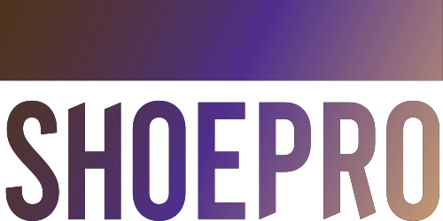

# SHOEPRO 

## 👟 서비스 소개

  
SHOEPRO는 스니커즈를 최상의 컨디션으로 오랫동안 신고,  
보관할 수 있도록 돕는 슈케어 브랜드입니다.  
슈클리너 판매와 더불어, 클리닝 서비스를 제공하고 있습니다.

**[🏃 SHOEPRO 구경하기](https://www.shoepro.co.kr)**

## 🛠 기술 스택
#### Front-end
    

#### Back-end
   

#### DB
 

#### Deploy
 

#### Payment

#### SMS

## 💻 주요 기능
1. SMS 인증을 통한 회원가입, 이메일 찾기, 비밀번호 찾기 
2. 장바구니에 상품과 서비스를 각각 담아서 관리하기
3. 신용카드 혹은 계좌이체로 결제하기
4. 포인트 적립, 쿠폰 사용하기
5. 주문 취소하기
6. 배송 조회하기
7. 리뷰 작성 및 상품 문의 작성하기

## ✋ 팀 소개
개발자 부트캠프를 수료한 신입 개발자 2명이 모인 팀입니다.   
어려움을 스스로 헤쳐나갔기에, 더욱 뜻 깊었습니다.

| 이름 | Position | Github |
| --- | -------- | ------ |
| 박지훈 | Front-end |  |
| 이종석 | Back-end |  |

## ℹ️ More Info
1. 프로젝트를 진행했던 기간은 어떻게 되나요?
* Front-end: 2021/09/23 ~ 2021/11/26 - (2개월)
* Back-end: 2021/08/02 ~ 2021/11/26 - (4개월)
2. 소스 파일은 왜 없나요?
* 개발했던 코드는 회사의 소유이기 때문에, 가지고 있지 않습니다.
